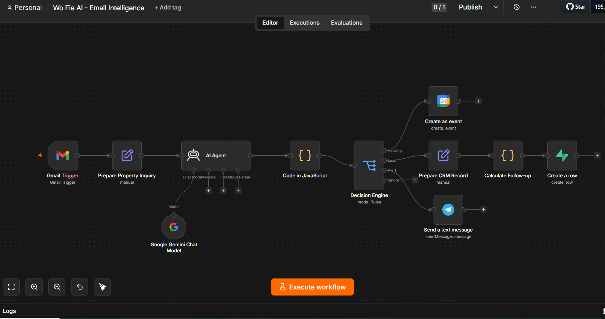
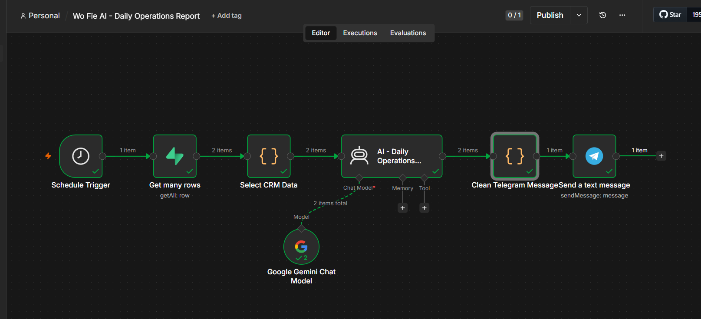
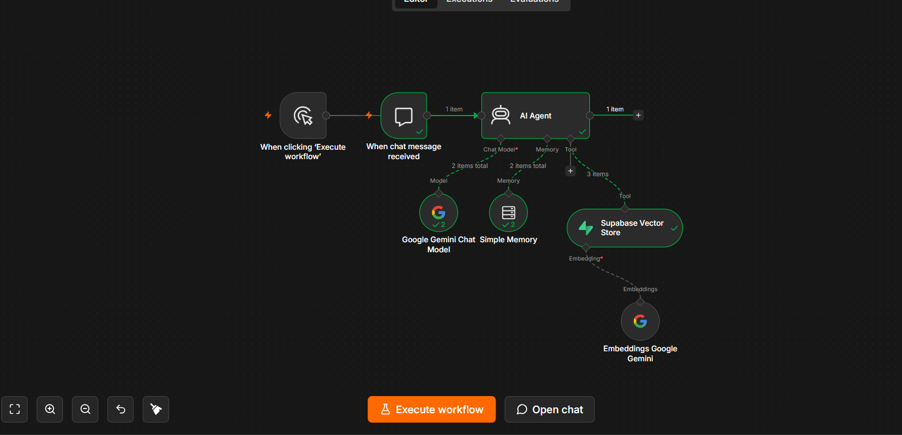
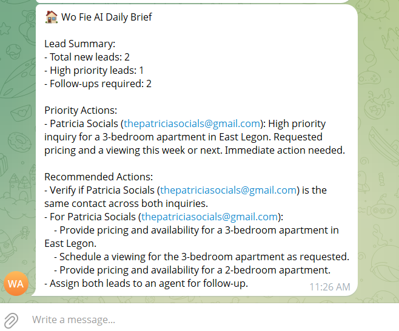
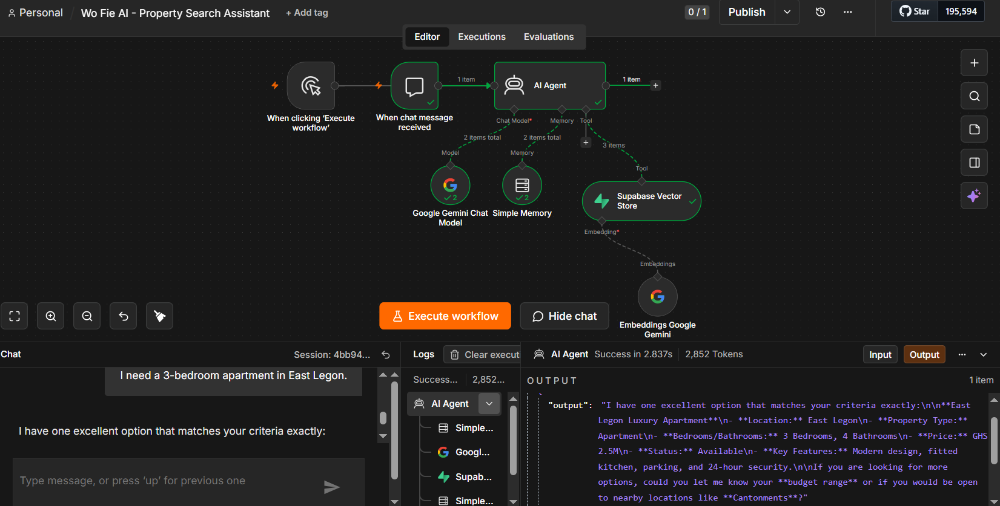

<div align="center">

# Wo Fie AI

### AI-Powered Real Estate Operations Assistant

*Automating real estate operations with AI Agents, Workflow Automation, and Retrieval-Augmented Generation (RAG).*


</div>

---

# Overview

**Wo Fie AI** is an AI-powered operations assistant built for modern real estate agencies.

Instead of manually reading emails, prioritizing leads, searching spreadsheets, and responding to customers, Wo Fie AI automates the entire process using AI.

The system classifies incoming inquiries, stores structured data in Supabase, notifies the operations team, generates daily operational summaries, and intelligently recommends properties using a Retrieval-Augmented Generation (RAG) knowledge base.

---

# The Problem

Real estate agencies spend hours every day:

- Reading buyer emails manually
- Prioritizing customer inquiries
- Updating spreadsheets and CRMs
- Searching through hundreds of property listings
- Following up with interested buyers

These repetitive tasks slow response times and reduce productivity.

---

# The Solution

Wo Fie AI automates these workflows using AI Agents and workflow automation.

The platform:

✅ Reads buyer inquiries automatically

✅ Classifies customer intent using AI

✅ Prioritizes leads

✅ Updates a Supabase database

✅ Sends Telegram notifications

✅ Generates daily operational summaries

✅ Searches a vector database to recommend suitable properties

---

# System Architecture

## Lead Processing Pipeline

```text
Buyer Email
      │
      ▼
 Gmail Trigger
      │
      ▼
 AI Agent (Google Gemini)
      │
      ▼
 Structured JSON
      │
      ▼
 Supabase Database
      │
      ├────────► Telegram Notifications
      │
      └────────► Daily Operations Brief
```

---

## Property Recommendation Pipeline (RAG)

```text
User Question
      │
      ▼
 AI Agent
      │
      ▼
 Supabase Vector Store
      │
      ▼
 Semantic Search
      │
      ▼
 Relevant Property Documents
      │
      ▼
 Google Gemini
      │
      ▼
 Natural Language Recommendation
```

---

# Features

## AI Lead Classification

Automatically extracts:

- Lead Category
- Priority
- Lead Type
- Summary
- Recommended Action
- Confidence Score

---

## Database Automation

Automatically updates Supabase with:

- Buyer information
- Lead priority
- Status
- AI summaries
- Follow-up actions

---

## Telegram Notifications

Every new inquiry automatically generates an operational notification for the team.

Example:

```
New Buyer Inquiry

Priority: High

Location: East Legon

Property:
3 Bedroom Apartment

Action:
Schedule Viewing
```

---

## Daily Operations Brief

Automatically generates reports such as:

```
Lead Summary

• Total Leads

• High Priority Leads

• Follow-ups Required

Priority Actions

Recommended Actions
```

---

## AI Property Search (RAG)

Instead of relying only on the language model,

Wo Fie AI searches a vector database before answering.

Example:

**User**

> Find me a 3-bedroom apartment in East Legon.

**AI**

> I found the East Legon Luxury Apartment.
>
> • 3 Bedrooms
>
> • 4 Bathrooms
>
> • GHS 2.5M
>
> • Parking
>
> • Fitted Kitchen
>
> • 24-hour Security

---

# Tech Stack

| Category | Technology |
|----------|------------|
| Automation | n8n |
| AI | Google Gemini |
| AI Architecture | AI Agents |
| Knowledge Retrieval | RAG |
| Database | Supabase PostgreSQL |
| Vector Database | pgvector |
| Messaging | Telegram Bot |
| Email | Gmail |
| Embeddings | Google Gemini Embeddings |

---

# Workflows

## 1. Lead Processing

- Gmail Trigger
- AI Classification
- JSON Parsing
- Supabase Update
- Telegram Notification

---

## 2. Daily Operations

- Retrieve Leads
- AI Summary
- Telegram Report

---

## 3. Property Recommendation

- AI Agent
- Vector Search
- Google Gemini
- Natural Language Response

---

# Screenshots

## Lead Processing Workflow

> 

---

## Daily Operations Workflow

> 

---

## Property Recommendation Workflow

> 

---

## Telegram Notifications

> 

---

## AI Chat Demo

> 

---

# Repository Structure

```
Wo-Fie-AI/

├── README.md

├── workflows/
│   ├── lead-processing.json
│   ├── daily-operations.json
│   └── property-rag-assistant.json

├── database/
│   ├── schema.sql
│   └── match_documents.sql

├── screenshots/

└── assets/
```

---

# Skills Demonstrated

- AI Workflow Automation
- n8n
- Google Gemini
- AI Agents
- Prompt Engineering
- Retrieval-Augmented Generation (RAG)
- Vector Databases
- PostgreSQL
- Supabase
- Semantic Search
- API Integrations
- Business Process Automation

---

# Challenges Solved

During development, I solved several real-world engineering challenges including:

- Building structured AI outputs for automation
- Implementing semantic search with pgvector
- Creating a custom PostgreSQL `match_documents()` function
- Debugging vector indexing and retrieval
- Integrating AI Agents with Supabase Vector Store
- Designing an end-to-end RAG pipeline in n8n
- Automating lead management workflows

---

# Future Improvements

- WhatsApp Integration
- CRM Integration
- Property Viewing Scheduling
- Voice Assistant
- Predictive Lead Scoring
- Analytics Dashboard

---

# About Me

Hi! I'm **Patricia Fleku**, an aspiring AI Automation Engineer passionate about building intelligent workflow automation systems that solve real business problems.

I'm currently focused on:

- AI Agents
- Workflow Automation
- n8n
- RAG Applications
- Business Process Automation

Let's connect!

**LinkedIn:** *https://www.linkedin.com/in/patricia-fleku/*

---

<div align="center">

### ⭐ If you found this project interesting, consider starring the repository!

</div>
